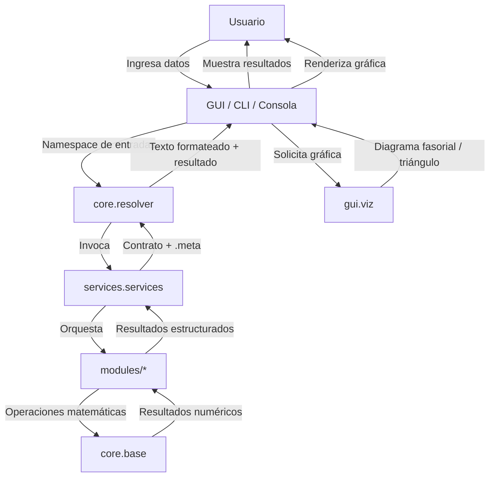

# Arquitectura de SPT — Analizador de Sistemas Eléctricos de Potencia

Este documento describe la arquitectura de alto nivel del proyecto SPT (`analizador-sep`) orientada a directores técnicos y tomadores de decisión. No entra en detalles de implementación; su propósito es comunicar la responsabilidad de cada componente, el flujo de datos entre capas y los contratos de entrada/salida que garantizan la estabilidad del sistema.

---

## 1. Mapa de Componentes

### Raíz del paquete

| Archivo | Responsabilidad |
|---|---|
| `__init__.py` | Expone la versión pública del paquete y sirve como punto de anclaje para importaciones del módulo `analizador`. |
| `main.py` | Punto de entrada de la aplicación CLI; presenta el menú principal y enruta la selección del usuario hacia menús temáticos, la consola de comandos o el asistente guiado. |
| `config.py` | Centraliza la configuración global, constantes y el catálogo de mensajes de error canónicos utilizados por toda la aplicación. |
| `errors.py` | Define la jerarquía de excepciones `AnalizadorError` y la fábrica `error_analizador`, estandarizando los códigos de error como `analizador:<modulo>:<codigo>`. |
| `utils.py` | Provee funciones de formateo de fasores y potencias, helpers de entrada por consola, resolución de rutas de exportación y serialización a TXT/JSON/CSV/XLSX. |

### `core/` — Modelo de dominio puro

| Archivo | Responsabilidad |
|---|---|
| `core/__init__.py` | Re-exporta los artefactos públicos del modelo para mantener compatibilidad con imports absolutos tipo `from analizador.core import ...`. |
| `core/base.py` | Contiene el núcleo matemático puro: conversión de fasores, potencia compleja, ley de Ohm, admitancias, factor de potencia y validaciones de entrada. |
| `core/circuito.py` | Modela el estado de circuitos monofásicos y trifásicos balanceados mediante las clases `CircuitoMonofasico` y `CircuitoTrifasico`; acumula fuente, línea y cargas hasta resolver la red. |
| `core/resolver.py` | Actúa como adaptador de la GUI hacia los servicios, recibiendo un identificador de cálculo y un namespace de datos, y devolviendo texto formateado más el contrato de resultados. |
| `core/exercises.py` | Agrupa los ejercicios verificados del Taller 2026 y ejemplos reproducibles, consumiendo exclusivamente funciones del núcleo y los módulos de dominio. |

### `gui/` — Vista

| Archivo | Responsabilidad |
|---|---|
| `gui/__init__.py` | Marca el paquete de interfaz gráfica y define su namespace público. |
| `gui/app.py` | Ventana principal de la aplicación de escritorio en CustomTkinter; configura el sidebar, el área de trabajo dinámica y la navegación entre vistas. |
| `gui/components.py` | Biblioteca de componentes visuales reutilizables (tarjetas, entradas etiquetadas, feedback de estado) utilizados por todas las vistas. |
| `gui/menus.py` | Implementa los menús interactivos de la CLI por tema, recolectando entradas del usuario y delegando la ejecución a la capa de servicios. |
| `gui/viz.py` | Genera visualizaciones con matplotlib, incluyendo diagramas de fasores en coordenadas polares y triángulos de potencias P-Q-S. |
| `gui/views/__init__.py` | Inicializa el subpaquete de vistas temáticas de la GUI. |
| `gui/views/potencia.py` | Vista de potencia compleja; captura datos del usuario y los envía al resolvedor para obtener el resultado formateado. |
| `gui/views/correccion.py` | Vista de corrección de factor de potencia; recolecta entradas y presenta el resultado de la compensación capacitiva. |
| `gui/views/circuito.py` | Vista de circuito mono/trifásico; permite definir fuente, línea y cargas en paralelo, e invoca las clases del core para resolver y reportar. |
| `gui/views/per_unit.py` | Vista de sistema por unidad; recibe valores base y magnitud, y muestra el resultado en por unidad. |

### `controllers/` — Controlador

| Archivo | Responsabilidad |
|---|---|
| `controllers/__init__.py` | Paquete reservado para futuros controladores que orquesten la comunicación entre la vista (`gui`) y el modelo (`core`). |

### `services/` — Servicios y asistentes

| Archivo | Responsabilidad |
|---|---|
| `services/__init__.py` | Re-exporta las fachadas `service_*` para preservar imports absolutos del tipo `from analizador.services import ...`. |
| `services/services.py` | Capa de fachadas que orquesta cálculos completos, captura excepciones y devuelve contratos de datos con metadatos pedagógicos `.meta`. |
| `services/asistente.py` | Implementa el asistente guiado paso a paso y la consola de comandos REPL con parser natural para circuitos monofásicos y trifásicos. |

### `modules/` — Módulos de dominio temáticos

| Archivo | Responsabilidad |
|---|---|
| `modules/__init__.py` | Inicializa el paquete de módulos temáticos y facilita imports agrupados. |
| `modules/circuitos.py` | Resuelve circuitos monofásicos serie/paralelo R-X y circuitos con fuente e impedancias. |
| `modules/componentes_simetricas.py` | Realiza transformaciones entre componentes de fase abc y componentes simétricas 012. |
| `modules/correccion_fp.py` | Calcula la potencia reactiva de compensación, reactancia capacitiva y valor de capacitor para corrección de factor de potencia. |
| `modules/cortocircuitos.py` | Determina corrientes de falla para cortocircuitos trifásicos, línea-tierra, línea-línea y doble-línea-tierra. |
| `modules/estabilidad.py` | Aplica el criterio de áreas iguales y calcula el tiempo crítico de clearing en estabilidad transitoria. |
| `modules/flujo_potencia.py` | Resuelve flujo de potencia entre dos barras y ejecuta flujo de carga N-barras por Newton-Raphson y Gauss-Seidel. |
| `modules/maquinas.py` | Modela la máquina síncrona calculando la FEM interna y la curva potencia-ángulo. |
| `modules/per_unit.py` | Gestiona conversiones al sistema por unidad, cambio de base y cálculo de valores base. |
| `modules/potencia_compleja.py` | Calcula potencia compleja a partir de V-I, V-Z, P-FP-tipo, suma de cargas y corriente de fuente. |
| `modules/sistemas_trifasicos.py` | Resuelve cargas trifásicas balanceadas y conversiones entre conexiones estrella y delta. |
| `modules/transformadores.py` | Modela transformadores ideales, equivalentes, regulación de tensión, pérdidas/eficiencia y cambios de base p.u. |

---

## 2. Flujo de Datos

### Descripción del flujo

1. El usuario interactúa con cualquiera de las tres interfaces: la GUI de escritorio (`gui.app`), el menú CLI (`main.py` / `gui.menus`) o la consola de comandos (`services.asistente`).
2. La vista construye un `SimpleNamespace` con los datos de entrada y lo pasa al `core.resolver`, quien actúa como adaptador hacia la capa de servicios.
3. `services.services` selecciona la fachada apropiada y orquesta los módulos de dominio (`modules/*`), que a su vez utilizan el núcleo matemático (`core.base`) para ejecutar cálculos puros.
4. El resultado regresa como un contrato de datos con metadatos pedagógicos (`.meta`) y es formateado por `utils.py` para presentación textual.
5. Si el usuario solicita una gráfica, `gui.viz` recibe los fasores o valores P-Q-S y genera visualizaciones con matplotlib, que la vista renderiza.

---

## 3. Tabla de Contratos

| Capa | Entradas | Procesos | Salidas |
|---|---|---|---|
| **gui** | Eventos de usuario, texto de consola, selecciones de menú. | Renderiza componentes, valida entradas básicas, construye namespaces de datos y despacha al backend. | Resultados formateados en pantalla, gráficas matplotlib, mensajes de error controlados. |
| **core** | Datos numéricos, impedancias, tensiones, potencias, parámetros de red. | Ejecuta álgebra fasorial, resuelve circuitos, adapta peticiones de la GUI y agrupa ejercicios verificados. | Escalares, arrays de numpy, `SimpleNamespace` con campos medidos y estructuras de circuito resueltas. |
| **services** | Modo de operación, argumentos posicionales, estructuras de entrada de la GUI. | Selecciona fachada, orquesta módulos de dominio, captura excepciones y enriquece resultados con metadatos `.meta`. | Contrato de datos (`SimpleNamespace` + `.meta`) o diccionario de error controlado `{codigo, mensaje, causa}`. |

---

## Principios de diseño

- **Separación de responsabilidades**: `core/` no contiene entrada/salida; `gui/` no contiene lógica de negocio; `services/` orquesta sin calcular directamente.
- **Contratos estables**: los servicios devuelven estructuras con `.meta`, permitiendo que la CLI, la GUI y los tests consuman el mismo backend sin acoplamiento.
- **Extensibilidad**: nuevos temas se agregan como módulos en `modules/` y se exponen mediante fachadas en `services/` sin modificar la vista.
